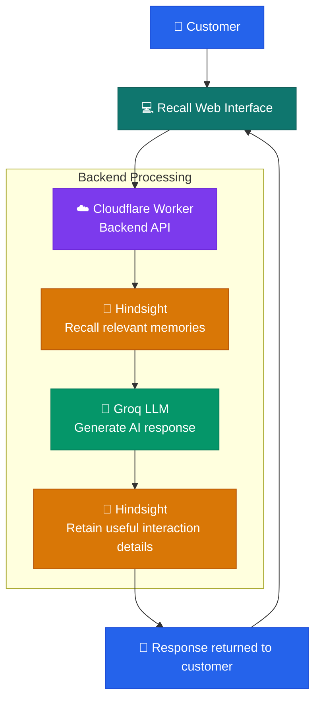
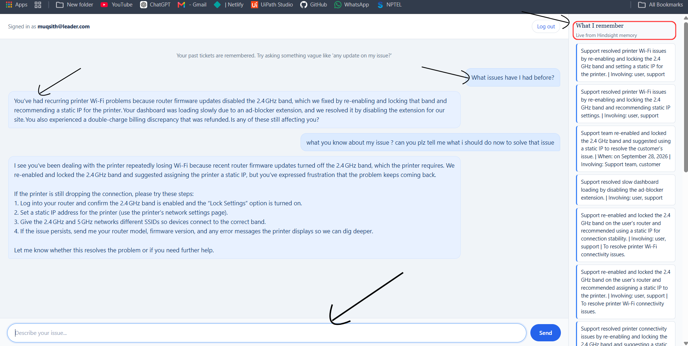
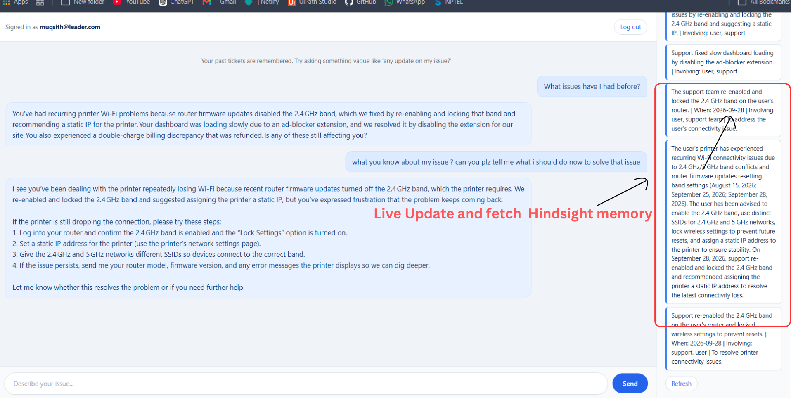
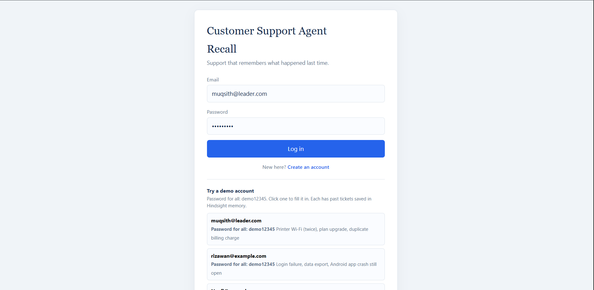

# Recall – AI-Powered Customer Support Agent

An AI customer support agent that remembers previous interactions
and uses persistent memory to provide context-aware support.

**Live Demo:** https://support-agent.abdulmuqsithofficial.workers.dev/

## Overview

Customers often need to repeat their problems when interacting
with support teams. Traditional chatbots may lack the context
needed to understand earlier issues and attempted solutions.

Recall addresses this problem with an AI-powered support agent
that uses Hindsight for persistent memory. It can retain relevant
conversation context and retrieve it in later interactions.

## Problem Statement

Customer support conversations often lose continuity between
interactions. Customers may have to explain their issue, device,
environment, and previous troubleshooting steps repeatedly.

## Our Solution

Recall is designed to provide a more continuous support experience
by combining an AI chat interface with persistent memory.

The system is intended to:

- Retain relevant details from support conversations.
- Recall useful context during later interactions.
- Generate responses informed by previous conversations.
- Provide a memory view to help demonstrate what the agent remembers.

## Key Features

- AI-powered customer support chat
- Persistent memory using Hindsight
- Context-aware responses based on recalled information
- User authentication
- Conversation history passed to the language model
- Memory inspection interface
- Cloud-deployed application

> Describe only the features that are implemented and working in
> your current deployed version.

## How Hindsight Is Used

Hindsight is the persistent memory layer in Recall.

At a high level, the application:

1. Receives a customer's message.
2. Retrieves relevant remembered context when available.
3. Uses the context and current conversation to generate a response.
4. Retains useful conversation information for future interactions.

This allows the agent to use information from previous interactions
instead of treating every conversation as entirely new.

See [Hindsight Integration](docs/HINDSIGHT_INTEGRATION.md)
for the implementation details.

## Technology Stack

- **Frontend:** HTML, CSS, JavaScript
- **Backend:** Cloudflare Workers
- **Database:** Cloudflare D1
- **AI model:** Groq API
- **Memory:** Hindsight by Vectorize
- **Deployment:** Cloudflare Workers

## Architecture
## System Architecture



See [Architecture](documentation/ARCHITECTURE.md) for more details.

See [Architecture](documents/ARCHITECTURE.md) for more details.

## Screenshots

### Chat Interface



### Memory View



### Login Page



## Getting Started

### Prerequisites

- A Cloudflare account
- A Cloudflare Worker project
- A Cloudflare D1 database
- A Hindsight API key
- A Groq API key
- Node.js and Wrangler, if using the Wrangler CLI

### Installation

1. Clone the repository:

   ```bash
   git clone https://github.com/YOUR_USERNAME/Recall-AI-Customer-Support-Agent.git
   cd Recall-AI-Customer-Support-Agent
   ```

2. Install the dependencies, if your project has a package.json:

   ```bash
   npm install
   ```

3. Configure the Cloudflare Worker and D1 database using
   the project's Wrangler configuration.

4. Add the required secrets using Wrangler:

   ```bash
   npx wrangler secret put HINDSIGHT_API_KEY
   npx wrangler secret put GROQ_API_KEY
   ```

5. Run locally:

   ```bash
   npx wrangler dev
   ```

6. Deploy:

   ```bash
   npx wrangler deploy
   ```

> Adapt these instructions to your actual project setup. If you
> use a different deployment workflow, document that instead.

## Environment Variables and Secrets

Configure the following secrets in your Cloudflare Worker:

| Name                | Purpose                             |
| ------------------- | ----------------------------------- |
| `HINDSIGHT_API_KEY` | Authenticates requests to Hindsight |
| `GROQ_API_KEY`      | Authenticates requests to Groq      |

The application also requires its configured D1 database binding.
Never commit real API keys, passwords, or production credentials.

## Demo

Live application:
https://support-agent.abdulmuqsithofficial.workers.dev/

Suggested demo flow:

1. Sign in with a demo account, if available.
2. Start a support conversation and describe an issue.
3. Show the memory interface and the retained context.
4. Return to the conversation and ask a follow-up question.
5. Demonstrate how recalled information affects the response.

Add screenshots or a demo video here once prepared.

## Project Documentation

- [System Architecture](documentation/ARCHITECTURE.md)
- [Hindsight Integration](documentation/HINDSIGHT_INTEGRATION.md)
- [Demo Script](documentation/DEMO_SCRIPT.md)

## Limitations and Future Improvements

Potential future work:

- Integration with external customer-support ticketing systems
- Improved memory relevance evaluation
- Human-agent escalation workflows
- More detailed testing and observability
- Customer data retention and deletion controls

## Security and Privacy

Do not use real customer information in public demonstrations.
Keep API keys in Cloudflare secrets and avoid committing sensitive
data, credentials, or private conversation logs.

## Hackathon

Built for the **AI Agents That Learn Using Hindsight** hackathon.

The project demonstrates the use of persistent memory in an
AI-powered customer support workflow.

## Author

**Abdul Muqsith**  
Computer Science Undergraduate | AI | Data Science | Full-Stack

- Portfolio: https://abdulmuqsith.pages.dev/
- LinkedIn: https://www.linkedin.com/in/abdul-muqsith-954906342

## Acknowledgements

- [Hindsight](https://hindsight.vectorize.io/)
- [Hindsight GitHub](https://github.com/vectorize-io/hindsight)
- [Groq](https://groq.com/)
- [Cloudflare Workers](https://developers.cloudflare.com/workers/)
